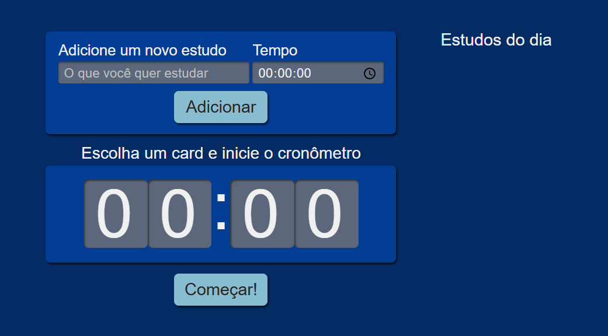

## Tela inicial



## Studies-app

É um app dedicado á gerenciar e organizar a forma de estudo.

### Projeto react-vite:

```bash
npm create vite@latest
```

### css-module:

Usado para adicionar tipagem aos estilos. Isso permite que o TypeScript saiba que uma classe de estilo existe e que ela deve ser uma string

```bash
npm i -D typescript-plugin-css-modules
```

### Estilo SCSS:

para criar estilos de forma mais organizada e eficiente:

```bash
npm i —save-dev sacc
```
